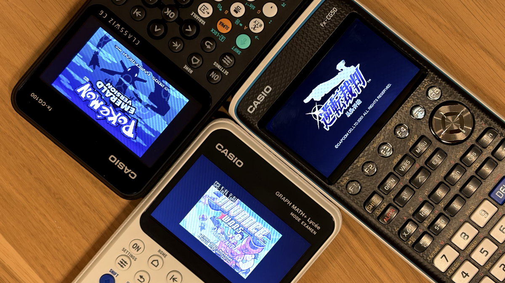

# gpSP for CASIO

gpSP for CASIO brings Game Boy Advance games to the **fx-CG50 / Graph 90+E** and **fx-CG100 / Graph Math+** graphing calculators. It builds on the popular [gpSP emulator maintained by libretro](https://github.com/libretro/gpsp) and adds a dynamic recompiler (JIT) designed for the calculators' SH-4A CPU.

Together with the built-in overclocking profile, the JIT lets many games run at or close to full speed. For more demanding games, automatic or manual frameskip can help keep gameplay smooth.

This project is fully vibe-coded using GPT-5.5 / Opus 4.8, and later GPT-5.6 Sol / Fable 5. It has been extensively tested on physical calculators to ensure it works properly.

## Features

- SH-4A dynamic recompiler (JIT) - it's a first!
- Built-in overclocking while the emulator is running
- ROM picker for `.gba` files in main storage
- Three display sizes and three scaling filters
- Automatic and manual frameskip
- Configurable GBA controls and emulator hotkeys
- 10 per-game savestate slots
- Persistent SRAM, Flash, and EEPROM in-game saves
- Cartridge RTC support for games with time-based events
- Fast-forward and an optional FPS overlay
- Bundled open-source GBA BIOS; no separate BIOS file is required

## Installation

1. Open the [Releases page](https://github.com/KaraRyougi/gpsp-sh4-jit/releases) and download the `.g3a` file for your calculator. Choose the file containing `CG50` or `CG100` in its name, as appropriate. You can also [build gpSP from source](#building-from-source).
2. Copy the `.g3a` file to the root of the calculator's main storage.
3. (**fx-CG100 / Graph Math+ only**) Download and copy the `mpm.bin` file to the root of the calculator’s main storage. This version of mpm is built from the [dynload branch](https://git.planet-casio.com/PlaneteCasio/mpm/src/branch/dynload), which provides more usable RAM for gpSP.
5. Disconnect the calculator safely, then launch **gpSP** from the main menu.

The two calculator builds are model-specific, so make sure you download the right one. gpSP scans for ROMs when it starts; if you add another ROM while gpSP is open, simply restart the emulator to refresh the list. The ROM picker can show up to 48 games, with a maximum size of 16 MiB per ROM.

## Usage

When gpSP opens, you will see the settings menu. Highlight **ROM SOURCE** and use Left or Right to choose a game, then select **LOAD NEW GAME**. During gameplay, press your calculator's menu key at any time to pause and return to this menu:

| Action                              | fx-CG50 / Graph 90+E | fx-CG100 / Graph Math+ |
| ----------------------------------- | -------------------- | ---------------------- |
| Open the gpSP menu                  | `AC/ON`              | `ON`                   |
| Move through the menu               | Arrow keys           | Arrow keys             |
| Change a setting                    | Left / Right         | Left / Right           |
| Select                              | `EXE`                | `EXE` or `OK`          |
| Go back                             | `EXIT`               | `BACK`                 |
| Exit gpSP immediately from the menu | `MENU`               | `HOME`                 |

The interface will feel familiar if you have used the gpSP port for the TI-Nspire CX. Settings are not saved automatically, so choose **SAVE CONFIG** after changing the controls or graphics options if you want to keep them for the next launch.

### Default key bindings

Want a different layout? You can remap every GBA button under **CONFIGURE GAMEPAD INPUT**. Only the gpSP menu key is reserved. Emulator hotkeys start unassigned, so they will not interfere with the normal controls.

#### fx-CG50 / Graph 90+E

| GBA control | Calculator key |
| ----------- | -------------- |
| A           | `MENU`         |
| B           | `EXIT`         |
| Select      | `^`            |
| Start       | `VARS`         |
| D-pad       | Arrow keys     |
| L           | `F5`           |
| R           | `F6`           |
| gpSP menu   | `AC/ON`        |

#### fx-CG100 / Graph Math+

| GBA control | Calculator key    |
| ----------- | ----------------- |
| A           | `OK`              |
| B           | `CATALOG` (`CAT`) |
| Select      | `Page Up`         |
| Start       | `Page Down`       |
| D-pad       | Arrow keys        |
| L           | `BEGIN`           |
| R           | `END`             |
| gpSP menu   | `ON`              |

You can also assign hotkeys for **Fast Forward**, **Load State**, **Save State**, and **Display FPS**. **Save+Exit** appears in the menu, but it is not implemented yet.

## Display modes

The **GRAPHICS OPTIONS** menu offers three ways to fit the GBA picture onto the calculator's 396×224 display:

| Menu setting | Resolution |       Aspect ratio | What it looks like                                           |
| ------------ | ---------: | -----------------: | ------------------------------------------------------------ |
| Unscaled 1:1 |    240×160 |                3:2 | The original GBA resolution, centered with a border and no scaling |
| 4:3          |    320×212 | 80:53 (almost 3:2) | A larger image that stays very close to the GBA's original shape |
| Fullscreen   |    384×216 |               16:9 | The largest picture; it nearly fills the screen but stretches the original 3:2 image horizontally |

The **4:3** name refers to the scaling factor—approximately four output pixels for every three source pixels—not the picture's aspect ratio. Its 320×212 output is still very close to the GBA's native 3:2 ratio. **Fullscreen** uses a true 16:9 picture ratio.

For either scaled mode, you can choose the look you prefer:

- **Smooth** softens the image and blends jagged edges.
- **Sharp** keeps more definition while still using some blending.
- **Crisp** uses nearest-neighbor scaling for hard, pixelated edges.

If a game feels slow, try **Automatic** frameskip first. **Manual** gives you a fixed frameskip value, while **Off** draws every frame. The optional FPS overlay shows both the emulation rate (`E`) and the number of frames actually drawn to the screen (`D`).

The **60 FPS LIMIT** option is enabled by default. It keeps games from running faster than the GBA’s native rate. This limit is global regardless of the frameskip setting. It only caps games that would otherwise run too quickly. It cannot speed up a game running below 60 FPS. **Fast Forward** temporarily bypasses the limit. Turn the option off if you want unrestricted speed or are benchmarking performance.

## Save data and savestates

Regular in-game GBA saves are supported and stored in `.SAV` files named after the ROM. gpSP writes new save data to storage when you change games or exit the emulator.

To make sure your latest progress is written safely, use **EXIT GPSP**, press `MENU` on the fx-CG50 or `HOME` on the fx-CG100 while the gpSP menu is open, or load another game before turning off or resetting the calculator.

Savestates are stored in ROM-named `.SVS` files. Choose a slot from 0 to 9, then select **SAVE STATE TO SLOT** or **LOAD STATE FROM SLOT**. If you prefer, you can assign quick-save and quick-load hotkeys for the currently selected slot.

gpSP forms save filenames from the first six alphanumeric characters in the ROM filename. Make those six characters unique for each game so that two ROMs do not accidentally share the same save files.

Savestates may not work across different gpSP releases, so regular in-game saves are the safer choice for long-term progress.

## Notes and current limitations

- There is no sound support yet.
- The Cheats menu is present, but the cheat loader is not implemented.
- `Save+Exit`, link cable, wireless, netplay, and rumble are not supported.
- Not every game will work perfectly.
- The built-in overclock is active only while gpSP is running. gint restores the calculator's previous clock settings when gpSP exits or calls the OS.

## Reporting gameplay issues

Found a crash, graphical glitch, save problem, incorrect behavior, or unusually slow part of a game? Please [open a gameplay issue on GitHub](https://github.com/KaraRyougi/gpsp-sh4-jit/issues/new). Reports from real calculators are especially helpful.

Before opening a new issue, check the [existing issues](https://github.com/KaraRyougi/gpsp-sh4-jit/issues) to see whether someone has already reported the same problem. If possible, also try the latest gpSP release.

Please include:

- Your calculator model: fx-CG50 / Graph 90+E or fx-CG100 / Graph Math+
- The gpSP version shown in the add-in information
- The game's title, region, and revision, if known
- What you expected to happen and what happened instead
- Clear steps that reproduce the problem, starting from launching gpSP
- Your display mode, scaling filter, frameskip settings, and any custom key mappings
- For performance problems, the `E` and `D` values from the FPS overlay and the part of the game where the slowdown occurs
- Any error message, photo, or short video that helps show the problem

## Trimming ROMs

If storage space is tight, larger GBA ROMs such as Pokémon Emerald can sometimes be made smaller by removing unused padding from the end of the file. This can help them fit on the calculator while leaving room for other add-ins. Use the [online gpSP ROM trimmer](https://kararyougi.github.io/gpsp-sh4-jit/). It runs locally in your browser and removes only trailing empty padding; it does not compress or otherwise change the game's data.

Keep a backup of the original ROM before trimming it.

## Building from source

Calculator builds require [fxSDK](https://git.planet-casio.com/Lephenixnoir/fxsdk) and [gint](https://git.planet-casio.com/Lephenixnoir/gint).

For an fx-CG100 JIT build:

```sh
ports/fxcg100/build-calc-jit.sh
```

Set `FXSDK_PREFIX=/path/to/fxsdk/prefix` if fxSDK is not detected automatically. The script produces `gpSP.g3a` and also places a visible copy on the desktop by default.

For an fx-CG50 / Graph 90+E JIT build:

```sh
cd ports/fxcg100/gint-gpsp
fxsdk build-cg -c -DCGBA_FXCG50=ON -DCGBA_DYNAREC=ON
fxsdk build-cg
```

The resulting add-in is `ports/fxcg100/gint-gpsp/gpSP.g3a`.

Developers can find the SH-4 JIT design, BIOS/SWI implementation, performance history, and test procedures in the [technical documentation](docs/README.md).

## Credits and license

- [gpSP](https://github.com/libretro/gpsp) and its original contributors
- [gint](https://git.planet-casio.com/Lephenixnoir/gint) and [fxSDK](https://git.planet-casio.com/Lephenixnoir/fxsdk) by the Planet Casio community
- The Ptune overclock profiles by CalcLoverHK and Sentaro21

This project is free software distributed under the [GNU General Public License v3](LICENSE).
